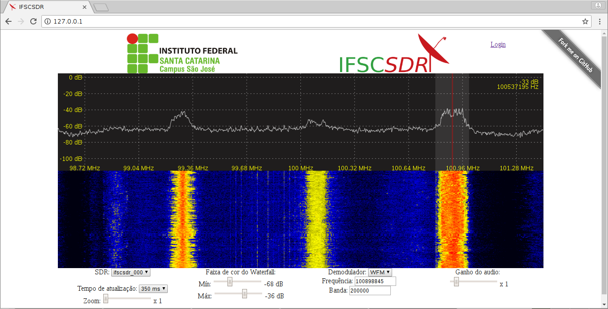

# IFSCSDR
IFSCSDR project was developed in [IFSC São José](https://www.sj.ifsc.edu.br/) under the supervision of Professor [Ramon Mayor Martins](https://wiki.sj.ifsc.edu.br/wiki/index.php/Ramon_Mayor_Martins).

Enter in ifscsdr\_devices\_controller and ifscsdr\_webserver directories and see README.md to install dependencies.
Webserver and devices controller can be installed in differents linux computers.

Enjoy!
